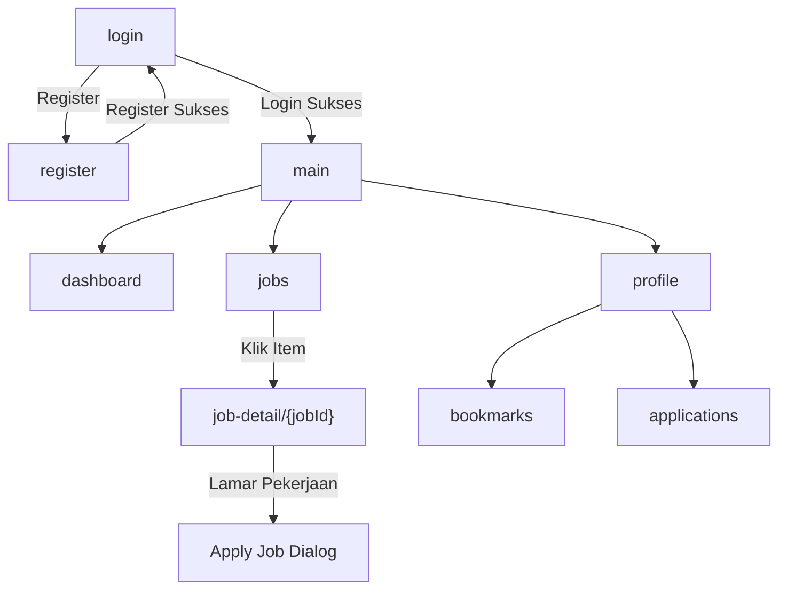

# 📱 JOBHUB Mobile — Route List & API Guide untuk Tim Frontend

> Dokumen ini berisi **daftar navigasi (routes)** di aplikasi Android beserta **endpoint API** dan **ViewModel** yang sudah disiapkan oleh tim backend. Gunakan dokumen ini sebagai acuan utama saat membangun UI/Screen.

---

## 🗺️ Peta Navigasi Aplikasi



---

## 🔐 Navigasi Level Atas (Root NavHost di `MainActivity.kt`)

Route-route ini berada di `NavHost` utama dan dikelola di `MainActivity.kt`.

| Route | Screen | ViewModel | Param | Status |
|---|---|---|---|---|
| `login` | `LoginScreen` | `AuthViewModel` | — | ✅ Sudah ada |
| `register` | `RegisterScreen` | `AuthViewModel` | — | ✅ Sudah ada |
| `main` | `MainScreen` | — | — | ✅ Sudah ada |

### Alur Navigasi Auth:
1. **Login** → Jika belum punya akun → `register`
2. **Register** → Sukses → `login`
3. **Login** → Sukses → `main`

---

## 📌 Navigasi Dalam `MainScreen` (Bottom Navigation Bar)

Route-route ini berada di `NavHost` kedua di dalam `MainScreen.kt`, dikelola oleh Bottom Navigation Bar.

| Route | Screen | ViewModel | Param | Status |
|---|---|---|---|---|
| `dashboard` | `DashboardScreen` | `DashboardViewModel` | — | ✅ Sudah ada |
| `jobs` | `HomeScreen` | `HomeViewModel` | — | ✅ Sudah ada |
| `profile` | `ProfileScreen` | `ProfileViewModel` | — | ⚠️ **Perlu dibuat** |

---

## 🆕 Route Baru yang Perlu Dibuat oleh Tim Frontend

Route-route ini belum dimasukkan ke `NavHost`. Tim frontend perlu menambahkan composable-nya dan menyambungkannya ke ViewModel yang sudah tersedia.

| Route | Screen (Buat Baru) | ViewModel (Sudah Ada) | Param | Keterangan |
|---|---|---|---|---|
| `job-detail/{jobId}` | `JobDetailScreen` | `JobDetailViewModel` | `jobId: Int` | Detail pekerjaan + tombol Lamar |
| `profile` | `ProfileScreen` | `ProfileViewModel` | — | Halaman profil user + edit profil |
| `applications` | `ApplicationScreen` | `ApplicationViewModel` | — | Daftar semua lamaran user |
| `bookmarks` | `BookmarkScreen` | `BookmarkViewModel` | — | Daftar pekerjaan yang di-bookmark |

---

## 📡 Referensi API Endpoint & ViewModel

### 1. Auth (sudah ada di `AuthViewModel`)

| Method | Endpoint | Fungsi ViewModel | Response | Keterangan |
|---|---|---|---|---|
| `POST` | `/api/register` | `register(name, email, phone, pass, passConf)` | `AuthResponse` | Daftarkan user baru |
| `POST` | `/api/login` | `login(email, password)` | `AuthResponse` | Login, menyimpan token |
| `POST` | `/api/logout` | — | `ApiResponse<Any>` | Hapus token (belum ada di ViewModel) |
| `GET` | `/api/me` | — | `User` | Ambil data user yang login |

---

### 2. Daftar Pekerjaan (sudah ada di `HomeViewModel`)

| Method | Endpoint | Fungsi ViewModel | Response | Keterangan |
|---|---|---|---|---|
| `GET` | `/api/jobs` | `fetchJobs()` | `JobResponse` (paginated) | Daftar lowongan kerja (support `?search=`, `?category_id=`, `?employment_type=`, `?work_type=`) |

---

### 3. Detail Pekerjaan & Melamar Kerja (`JobDetailViewModel`)

| Method | Endpoint | Fungsi ViewModel | Response | Keterangan |
|---|---|---|---|---|
| `GET` | `/api/jobs/{id}` | `fetchJobDetail(jobId)` | `JobListing` | Detail lowongan (judul, deskripsi, requirement, gaji, lokasi, dll) |
| `POST` | `/api/job-seeker/apply/{jobListing}` | `applyJob(jobId, coverLetter)` | `ApplyJobResponse` | Melamar pekerjaan. Body: `{ "cover_letter": "..." }`. 🔒 Auth required |

**State yang tersedia:**
- `jobDetailState`: `Loading` / `Success(job)` / `Error(msg)`
- `applyJobState`: `Idle` / `Loading` / `Success(msg)` / `Error(msg)`

---

### 4. Dashboard (`DashboardViewModel` — sudah ada)

| Method | Endpoint | Fungsi ViewModel | Response | Keterangan |
|---|---|---|---|---|
| `GET` | `/api/job-seeker/dashboard` | `fetchDashboard()` | `DashboardResponse` | Ringkasan: total lamaran, menunggu, diterima, + 5 lamaran terbaru. 🔒 Auth required |

---

### 5. Profil (`ProfileViewModel`)

| Method | Endpoint | Fungsi ViewModel | Response | Keterangan |
|---|---|---|---|---|
| `GET` | `/api/job-seeker/profile` | `fetchProfile()` | `User` (dengan nested `jobSeeker`) | Ambil data profil user. 🔒 Auth required |
| `POST` | `/api/job-seeker/profile` | `updateProfile(skills, exp, edu, phone, address, resumeFile)` | `ProfileUpdateResponse` | Update profil. Multipart form-data (mendukung upload PDF resume). 🔒 Auth required |

**State yang tersedia:**
- `profileState`: `Loading` / `Success(user)` / `Error(msg)`
- `updateState`: `Idle` / `Loading` / `Success(msg)` / `Error(msg)`

**Contoh pemanggilan di UI:**
```kotlin
val profileViewModel: ProfileViewModel = viewModel(factory = ...)
LaunchedEffect(Unit) { profileViewModel.fetchProfile() }

// Update profil
profileViewModel.updateProfile(
    skills = "Kotlin, Java",
    experience = "2 tahun Android Developer",
    education = "S1 Informatika",
    phone = "08123456789",
    address = "Jakarta",
    resumeFile = selectedPdfFile // atau null
)
```

---

### 6. Daftar Lamaran (`ApplicationViewModel`)

| Method | Endpoint | Fungsi ViewModel | Response | Keterangan |
|---|---|---|---|---|
| `GET` | `/api/job-seeker/applications` | `fetchApplications()` | `List<Application>` | Daftar semua lamaran user. 🔒 Auth required |
| `DELETE` | `/api/job-seeker/applications/{id}` | `cancelApplication(appId)` | `Map<String, String>` | Batalkan lamaran (hanya jika status masih `pending`). 🔒 Auth required |

**State yang tersedia:**
- `applicationState`: `Loading` / `Success(applications)` / `Error(msg)`
- `cancelState`: `Idle` / `Loading` / `Success(msg)` / `Error(msg)`

**Catatan:** Setiap `Application` memiliki properti:
- `id`, `status` (`pending` / `accepted` / `rejected`)
- `coverLetter`, `createdAt`
- `job_listing` (nested: `title`, `company.name`, `location`, dll)

---

### 7. Bookmark (`BookmarkViewModel`)

| Method | Endpoint | Fungsi ViewModel | Response | Keterangan |
|---|---|---|---|---|
| `GET` | `/api/job-seeker/bookmarks` | `fetchBookmarks()` | `List<Bookmark>` | Daftar pekerjaan yang di-bookmark. 🔒 Auth required |
| `POST` | `/api/job-seeker/bookmark/{jobListing}` | `toggleBookmark(jobId)` | `ToggleBookmarkResponse` | Toggle: jika sudah ada dihapus, jika belum ditambahkan. 🔒 Auth required |

**State yang tersedia:**
- `bookmarkState`: `Loading` / `Success(bookmarks)` / `Error(msg)`
- `toggleState`: `Idle` / `Loading` / `Success(msg, isBookmarked)` / `Error(msg)`

---

## 🏗️ Cara Membuat ViewModel di Composable

Semua ViewModel membutuhkan `SessionManager` untuk auth token. Gunakan pola factory berikut:

```kotlin
val profileViewModel: ProfileViewModel = viewModel(
    factory = object : ViewModelProvider.Factory {
        @Suppress("UNCHECKED_CAST")
        override fun <T : ViewModel> create(modelClass: Class<T>): T {
            return ProfileViewModel(sessionManager) as T
        }
    }
)
```

Buat ViewModel di `JobHubApp()` (di `MainActivity.kt`) atau di dalam composable route yang membutuhkannya.

---

## 📁 Struktur File

```
com.example.jobhub/
├── data/
│   ├── local/
│   │   └── SessionManager.kt         # Menyimpan auth token
│   └── model/
│       └── Models.kt                 # Semua data class (User, JobListing, Application, dll)
├── network/
│   ├── ApiClient.kt                  # Retrofit client (auto-detect emulator/device)
│   └── ApiService.kt                 # Semua endpoint API
├── ui/
│   ├── screens/
│   │   ├── LoginScreen.kt            ✅
│   │   ├── RegisterScreen.kt         ✅
│   │   ├── MainScreen.kt             ✅ (Bottom Nav)
│   │   ├── DashboardScreen.kt        ✅
│   │   ├── HomeScreen.kt             ✅ (Daftar Lowongan)
│   │   ├── JobDetailScreen.kt        ⚠️ PERLU DIBUAT
│   │   ├── ProfileScreen.kt          ⚠️ PERLU DIBUAT
│   │   ├── ApplicationScreen.kt      ⚠️ PERLU DIBUAT
│   │   └── BookmarkScreen.kt         ⚠️ PERLU DIBUAT
│   ├── viewmodel/
│   │   ├── AuthViewModel.kt          ✅
│   │   ├── DashboardViewModel.kt     ✅
│   │   ├── HomeViewModel.kt          ✅
│   │   ├── JobDetailViewModel.kt     ✅
│   │   ├── ProfileViewModel.kt       ✅
│   │   ├── ApplicationViewModel.kt   ✅
│   │   └── BookmarkViewModel.kt      ✅
│   └── theme/
│       └── Color.kt, Theme.kt, Type.kt
└── MainActivity.kt                   # Root Navigation
```

> **Legenda:** ✅ = Sudah dibuat | ⚠️ = Perlu dibuat oleh tim frontend
